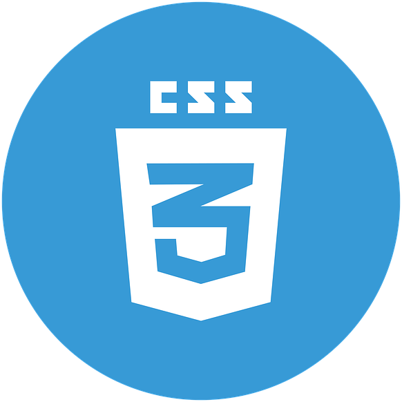
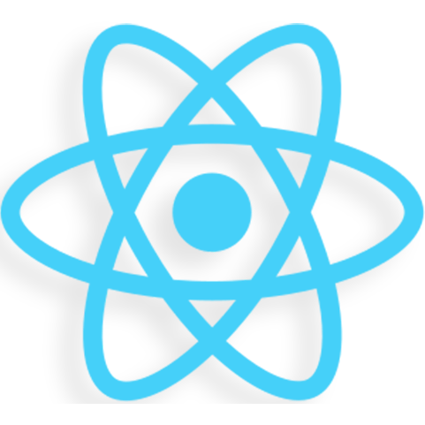
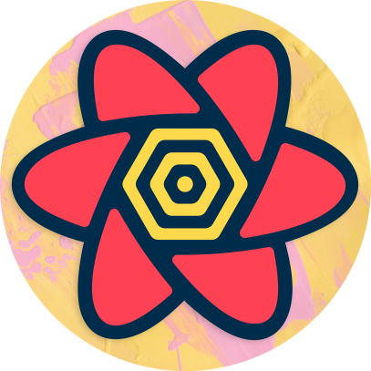
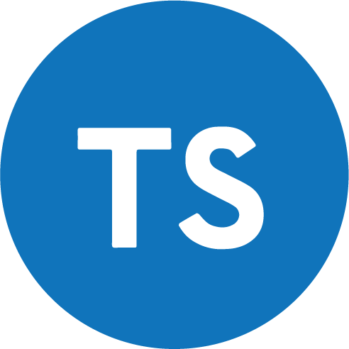

# <h1 align="Center">Countries app with TS, redux-toolkit, react-query and gsap</h1>

<h3 align="Center">Languages and Tools</h3>

  
  
  
  
  
  
  

### `API`

API URL : "https://restcountries.com/"  
API ENDPOINT : "https://restcountries.com/v3.1/all"

### `RUN`

Simply cd into project and run "npm install"  
When installation done, type "npm start"
